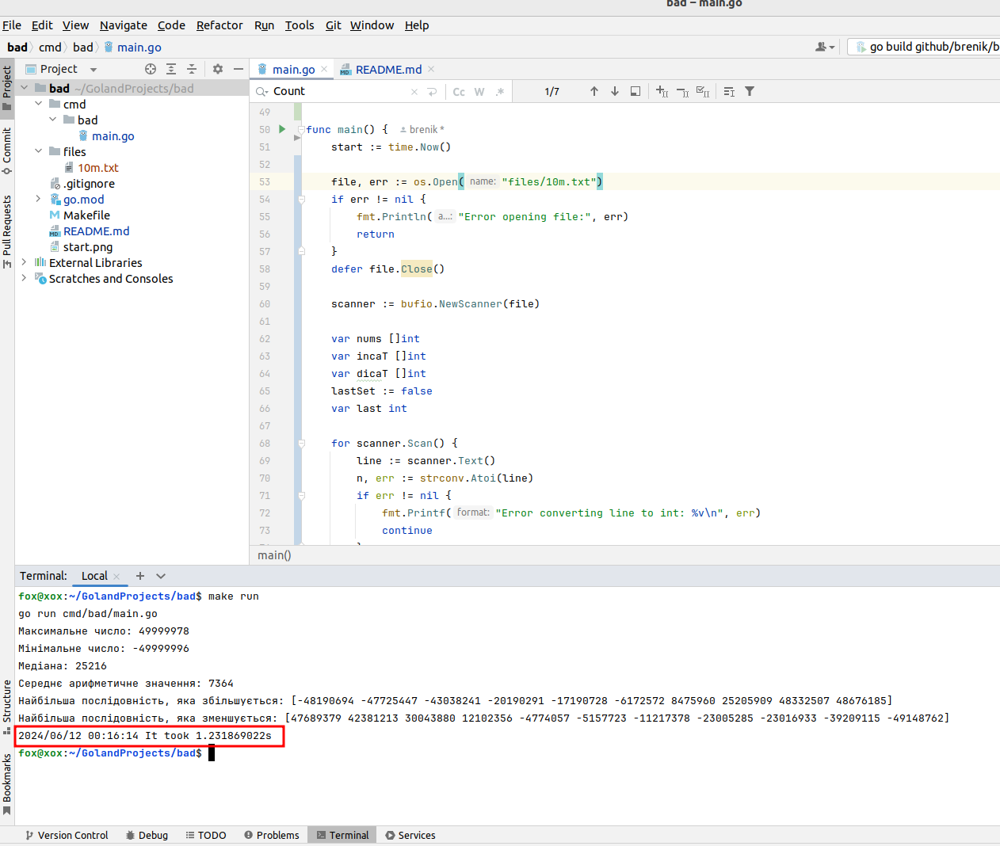

# BAD
Please execute cli command "make run" in root folder.
Golang must be installed.

2024.06.12Update function, simplify the code to avoid redundant operations. 
Use a quick-median-finding approach using a selection algorithm (Quickselect).
Searching all values take near 1.23s. The function worked 3 times faster now.

2024.02.29 Searching all values take near 4s.

